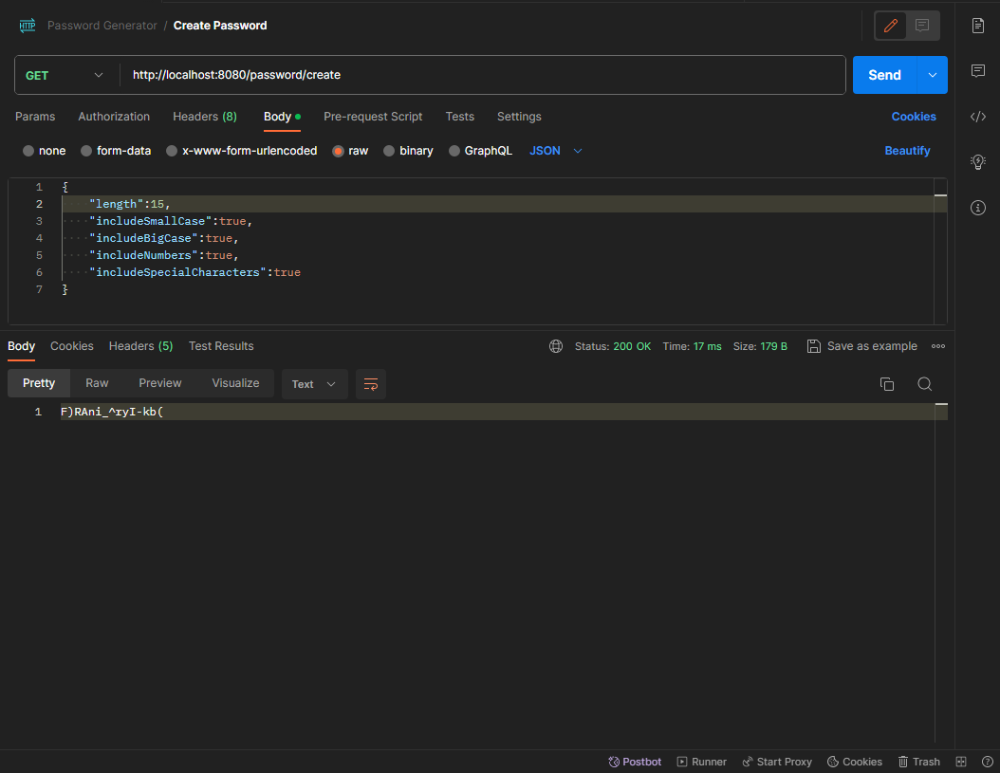

# PasswordGenerator
[](https://github.com/ualashenr/PasswordGenerator/blob/master/LICENSE) 

# Sobre o projeto
PasswordGenerator é um projeto que consiste na criação de senhas baseadas nas preferências do usuário, como incluir letras maiúsculas, minusculas, números, entre outros. Através de uma requisição HTTP o usuário consegue passar dados e receber a senha de acordo com suas preferências.

# Tecnologias utilizadas

## Back-end
* Java
* Spring
* Maven

# End Points

* `[Create Password](http://localhost:8080/password/create)`: Cria a senha.
* Caso não seja passado nenhum body na requisição, a senha possuira tamanho de 15 caracteres e incluira todos caracteres possíveis.
* As senhas são armazenadas em um arquivo .txt para evitar repetições.

# Postman


# Como executar o projeto

## Back-end

Pré-requisitos: Java 17

```bash
# clonar repositório
git clone https://github.com/ualashenr/PasswordGenerator.git

# entrar na pasta do projeto back end
cd backend

# executar o projeto
./mvnw spring-boot:run
```
# Autor
Ualas Henrique Bezerra Filho

https://www.linkedin.com/in/ualas-henrique-54678827a/
